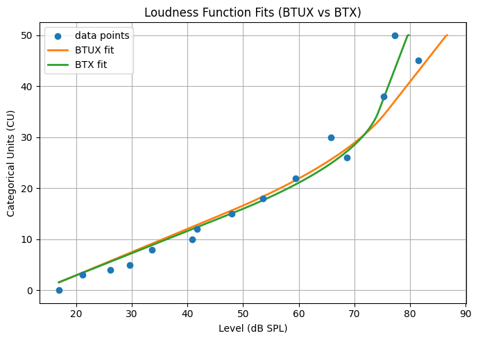

# Loudness Function Fitting Scripts — Overview (Modified Experimental Version)

These scripts implement a Python port of the **categorical loudness scaling (CLS) model**, based on the publication "Optimized loudness-function estimation for categorical loudness scaling data." (2014) by Dirk Oetting, Thomas Brand and Stephan D. Ewert
DOI: 10.1016/j.heares.2014.07.003

Original implementation supported by the authors, Stephan Ewert and Dirk Oetting, "Adaptive Categorical Loudness Scaling Procedure for AFC for Mathwork's MATLAB" can be found here: https://medi.uni-oldenburg.de/afc/

The present implementation includes loudness functions and multiple fitting strategies for estimating perceptual loudness growth from behavioural data.  
**This implementation supportes a custom default upper slope value in the BTUX method and user-selectable optimisation algorithms.**  

⚠️ **Important:** This is an **experimental implementation**, and is **not part of the original reference software nor supported by the original authors**.

---

## `core_loudness_curve.py`
Implements the **core piecewise loudness model** with a Bezier transition between low- and high-level slopes. It supports:
- Forward mapping: **level → categorical units (CU)**
- Inverse mapping: **CU → level**
- Linear extrapolation below 0 CU and above 50 CU  
This module forms the **mathematical backbone** of all fitting routines. 

---

## `loudness_model_wrapper.py`
High-level wrapper adapting the BH2002 model to a **parameterisation based on threshold and slope descriptors**:
- Parameters: `[m_low, HTL, m_high, (optional UCL)]`
- Automatic conversion to Bezier control parameters
- Forward and inverse evaluation  
This ensures **consistent mapping between level and categorical units**. 

---

## `bounded_optimizer.py`
Custom **bounded optimisation wrapper** based on a sine-transformation method. It allows:
- Hard lower/upper bounds on all parameters
- Use of multiple optimisers (see list below)
- Robust constrained fitting of nonlinear loudness models  
This replaces MATLAB’s `fminsearchbnd`. 

---

## `loudness_fit_engine.py`
Main **fitting engine** implementing several published CLS fitting modes:
- `BY`, `BX`, `BTX`, `BTUX`, `BTUY`, `BTPX`
- Threshold (HTL) and UCL estimation via psychometric pre-fit
- Error minimisation in the **level (x)** or **loudness (y)** domain

- **Custom default upper slope in BTUX**  
  When fewer than four data points are available above 35 CU, the upper slope `m_high` is no longer hard-coded. It is now set via a **user-defined `defaultUpperSlope` parameter**, allowing dataset-specific control.
- **User-selectable optimisation algorithm**  
  The optimiser can be chosen via the `optAlg` argument (as implemented in `fit_categorical_bh2001` and propagated through the full fitting pipeline).

The final fitted parameters are returned as:
[Lcut, m_low, m_high]

---

## Available Minimisation Algorithms

The fitting pipeline allows explicit selection of the numerical optimiser via the `optAlg` argument (used in both `fit_categorical_bh2001` and `run_bounded_opt`). The following algorithms are currently supported:

- **`NEL` — Nelder–Mead Simplex**
  - Derivative-free optimisation
  - Robust for noisy, non-smooth objective functions

- **`CG` — Conjugate Gradient**
  - Gradient-based method
  - Faster convergence for smooth cost functions
  - More sensitive to initialisation

- **`SLS` — Sequential Least Squares Programming (SLSQP)**
  - Handles constrained optimisation efficiently
  - Suitable when bounds strongly restrict parameter space

- **`TNC` — Truncated Newton**
  - Large-scale gradient-based optimisation
  - Efficient for higher-dimensional problems

- **`TRU` — Trust-Region (`trust-constr`)**
  - Second-order optimisation strategy
  - High numerical stability at the cost of increased computation time

---

## Example Output: BTUX vs BTX Fits

An **example is provided** demonstrating the difference between the **BTX and BTUX fitting methods**, using the same set of experimentally digitised datapoints with added x-axis jitter. This comparison highlights the impact of **upper-slope and UCL handling** between the two methods.

The figure below shows a direct visual comparison between **BTUX and BTX loudness-function fits** obtained from the experimental pipeline.

---
